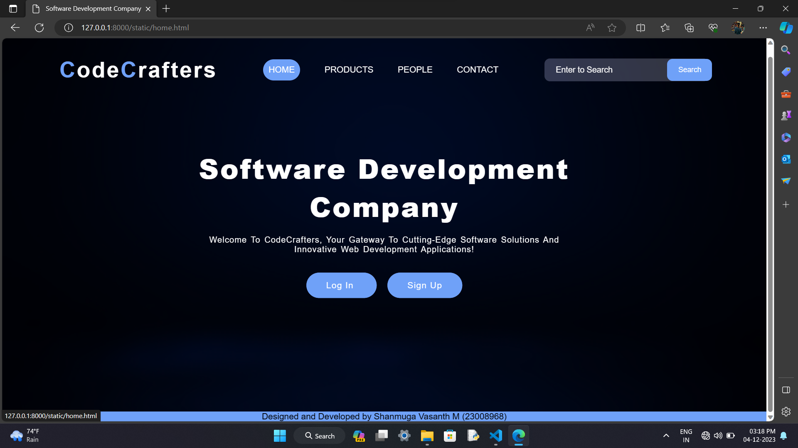
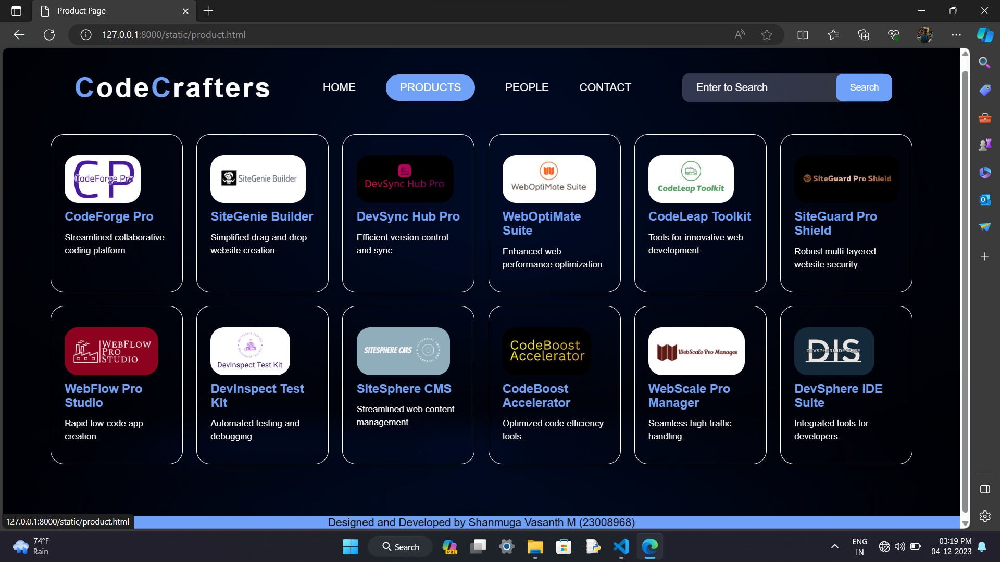
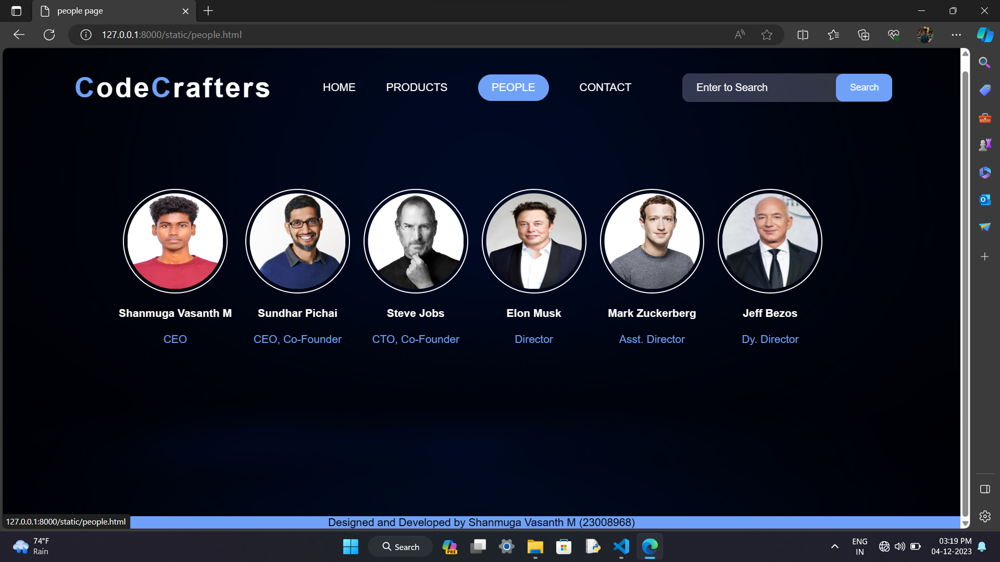
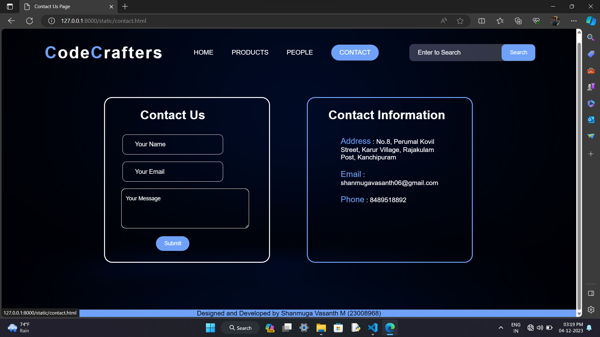

# Ex.07 Software Product Company Website
## Date: 04.12.2023

## AIM:
To develop a static company website to display the softwares and services provided by the company.

## DESIGN STEPS:

### Step 1:
Requirement collection.

### Step 2:
Creating the layout using HTML and CSS.

### Step 3:
Updating the sample content.

### Step 4:
Choose the appropriate style and color scheme.

### Step 5:
Validate the layout in various browsers.

### Step 6:
Validate the HTML code.

### Step 7:
Publish the website in the given URL.

## PROGRAM:
```
home.html

<html>
    <head>
        <meta name="viewport" content="width=device-width, initial-scale=1.0">
        <title> Software Development Company </title>
        <style type="text/css">
            * {
                margin: 0;
                padding: 0;
                font-family: Arial, Helvetica, sans-serif;
            }
            .banner {
                width: 100%;
                height: 100vh;
                background-image: linear-gradient(rgba(0,0,0,0.75),rgba(0,0,0,0.75)),url(background.jpg);
                background-size: cover;
                background-position: center;
            }
            .navbar {
                width: 85%;
                margin: auto;
                padding: 35px 0;
                display: flex;
                align-items: center;
                justify-content: space-between;
            }
            .logo {
                color: #6fa1f8;
                font-size: 40px;
                font-weight: 700;
                letter-spacing: 3px;
            }
            span {
                color: white;
            }
            form {
                width: 300px;
                height: 40px;
                display: flex;
                background: rgba(255, 255, 255, 0.2);
                padding: 1px 1px;
                font-size: 15px;
                border-radius: 10px;
                backdrop-filter: blur(4px) saturate(180%);
            }
            form input {
                background: transparent;
                flex: 1;
                border: 0;
                outline: none;
                padding: 12px 20px;
                font-size: 15px;
                color: white;
            } 
            ::placeholder {
                color: white;
            }
            form button {
                border: 0;
                outline: none;
                padding: 5px 20px;
                color: white;
                border-radius: 10px;
                background: #6fa1f8;
                cursor: pointer;
            }
            .navbar li {
                list-style: none;
                display: inline-block;
                margin: 0 20px;
                position: relative;
            }
            .navbar li a {
                text-decoration: none;
                color: white;
                text-transform: uppercase;
            }
            .navbar li:hover {
                border: 1px;
                padding: 10px;
                color: white;
                background-color: #6fa1f8;
                transition: 0.5s; 
                cursor: pointer;
                border-radius: 30px;
            }
            .content {
                position: absolute;
                top: 50%;
                left: 50%;
                transform: translate(-50%,-50%);
                text-align: center;
            }
            .text h2 {
                color: white;
                font-weight: 800;
                font-size: 50px;
                letter-spacing: 3px;
            }
            .text p {
                color: white;
                text-transform: capitalize;
                font-size: 15px;
                margin-bottom: 30px;
                word-spacing: 2px;
                letter-spacing: 1px;
            }
            .login {
                margin: 0px 10px;
                border: 2px solid #6fa1f8;
                padding: 13px 35px;
                letter-spacing: 1px;
                color: white;
                border-radius: 30px;
                background-color: #6fa1f8;
                text-decoration: none;
            }
            .login:hover {
                border: 2px solid #6fa1f8;
                color: #6fa1f8;
                background-color: white;
                transition: 0.5s;
                cursor: pointer;
            } 
            .signup {
                margin: 0px 10px;
                border: 2px solid #6fa1f8;
                padding: 13px 35px;
                letter-spacing: 1px;
                color: white;
                border-radius: 30px;
                background-color: #6fa1f8;
                text-decoration: none;
            }
            .signup:hover {
                border: 2px solid #6fa1f8;
                color: #6fa1f8;
                background-color: white;
                transition: 0.5s;
                cursor: pointer;
            }
            footer {
                background-color: #6fa1f8;
                margin-top: auto;
            }
        </style>
    </head>
<body>
    <div class="banner">
        <br>
        <div class="navbar">
            <h1 class="logo">C<span>ode</span>C<span>rafters</span></h1>
            <ul>
                <li><a href="http://127.0.0.1:8000/static/home.html"> Home </a></li>
                <li><a href="http://127.0.0.1:8000/static/product.html"> Products </a></li>
                <li><a href="http://127.0.0.1:8000/static/people.html"> People </a></li>
                <li><a href="http://127.0.0.1:8000/static/contact.html"> Contact </a></li>
            </ul>
            <form action="" method="get">
                <input type="text" placeholder="Enter to Search">
                <button type="submit"> Search </button>
            </form>
        </div>
        <div class="content">
            <div class="text">
                <h2> Software Development Company </h2>
                <br>
                <p> Welcome to CodeCrafters, your gateway to cutting-edge software solutions and innovative web development applications! </p>
                <br>
                <div>
                    <a href="#" class="login"> Log In </a>
                    <a href="#" class="signup"> Sign Up </a>
                </div>
            </div>
        </div>  
    </div>
    <footer>
        <center> Designed and Developed by Shanmuga Vasanth M (23008968) </center>
    </footer>
</body>
</html>

product.html

<html>
    <head>
        <meta name="viewport" content="width=device-width, initial-scale=1.0">
        <title> Product Page </title>
        <style type="text/css">
            * {
                margin: 0;
                padding: 0;
                font-family: Arial, Helvetica, sans-serif;
            }
            .banner {
                width: 100%;
                height: 100vh;
                background-image: linear-gradient(rgba(0,0,0,0.75),rgba(0,0,0,0.75)),url(background.jpg);
                background-size: cover;
                background-position: center;
            }
            .navbar {
                width: 85%;
                margin: auto;
                padding: 35px 0;
                display: flex;
                align-items: center;
                justify-content: space-between;
            }
            .bg-product {
                border: 1px;
                padding: 10px;
                color: white;
                background-color: #6fa1f8;
                border-radius: 30px;
            }
            .logo {
                color: #6fa1f8;
                font-size: 40px;
                font-weight: 700;
                letter-spacing: 3px;
            }
            span {
                color: white;
            }
            form {
                width: 300px;
                height: 40px;
                display: flex;
                background: rgba(255, 255, 255, 0.2);
                padding: 1px 1px;
                font-size: 15px;
                border-radius: 10px;
                backdrop-filter: blur(4px) saturate(180%);
            }
            form input {
                background: transparent;
                flex: 1;
                border: 0;
                outline: none;
                padding: 12px 20px;
                font-size: 15px;
                color: white;
            } 
            ::placeholder {
                color: white;
            }
            form button {
                border: 0;
                outline: none;
                padding: 5px 20px;
                color: white;
                border-radius: 10px;
                background: #6fa1f8;
                cursor: pointer;
            }
            .navbar li {
                list-style: none;
                display: inline-block;
                margin: 0 20px;
                position: relative;
            }
            .navbar li a {
                text-decoration: none;
                color: white;
                text-transform: uppercase;
            }
            .navbar li:hover {
                border: 1px;
                padding: 10px;
                color: white;
                background-color: #6fa1f8;
                transition: 0.5s; 
                cursor: pointer;
                border-radius: 30px;
            }
            .container {
                background: transparent;
                padding: 10px 5%;
                padding-bottom: 100px;
            }
            .container .box-container {
                display: grid;
                grid-template-columns: repeat(auto-fit, minmax(170px, 1fr));
                gap: 20px;
            }
            .container .box-container .box {
                color: white;
                box-shadow: 0 5px 10px rgba(0,0,0,.2);
                border-radius: 20px;
                background: transparent;
                border: 1px solid white;
                padding: 30px 20px;
            }
            .container .box-container .box img {
                height: 70px;
                border-radius: 20px;
            }
            .container .box-container .box h3 {
                color: #6fa1f8;
                font-size: large;
                padding: 10px 0;
            }
            .container .box-container .box p {
                color: white;
                font-size: small;
                line-height: 1.5;
            }
            footer {
                background-color: #6fa1f8;
                margin-top: auto;
            }
        </style>
    </head>
<body>
    <div class="banner">
        <br>
        <div class="navbar">
            <h1 class="logo">C<span>ode</span>C<span>rafters</span></h1>
            <ul>
                <li><a href="http://127.0.0.1:8000/static/home.html"> Home </a></li>
                <li><a href="http://127.0.0.1:8000/static/product.html" class="bg-product"> Products </a></li>
                <li><a href="http://127.0.0.1:8000/static/people.html"> People </a></li>
                <li><a href="http://127.0.0.1:8000/static/contact.html"> Contact </a></li>
            </ul>
            <form action="" method="get">
                <input type="text" placeholder="Enter to Search">
                <button type="submit"> Search </button>
            </form>
        </div>
        <div class="container">
            <div class="box-container">
                <div class="box">
                    
                    <h3> CodeForge Pro </h3>
                    <p> Streamlined collaborative coding platform. </p>
                </div>
                <div class="box">
                    
                    <h3> SiteGenie Builder </h3>
                    <p> Simplified drag and drop website creation. </p>
                </div>
                <div class="box">
                    
                    <h3> DevSync Hub Pro </h3>
                    <p> Efficient version control and sync. </p>
                </div>
                <div class="box">
                    
                    <h3> WebOptiMate Suite </h3>
                    <p> Enhanced web performance optimization. </p>
                </div>
                <div class="box">
                    
                    <h3> CodeLeap Toolkit </h3>
                    <p> Tools for innovative web development. </p>
                </div>
                <div class="box">
                    
                    <h3> SiteGuard Pro Shield  </h3>
                    <p> Robust multi-layered website security. </p>
                </div>
                <div class="box">
                    
                    <h3> WebFlow Pro Studio </h3>
                    <p> Rapid low-code app creation. </p>
                </div>
                <div class="box">
                    
                    <h3> DevInspect Test Kit </h3>
                    <p> Automated testing and debugging. </p>
                </div>
                <div class="box">
                    
                    <h3> SiteSphere CMS </h3>
                    <p> Streamlined web content management. </p>
                </div>
                <div class="box">
                    
                    <h3> CodeBoost Accelerator </h3>
                    <p> Optimized code efficiency tools. </p>
                </div>
                <div class="box">
                    
                    <h3> WebScale Pro Manager </h3>
                    <p> Seamless high-traffic handling. </p>
                </div>
                <div class="box">
                    
                    <h3> DevSphere IDE Suite </h3>
                    <p> Integrated tools for developers. </p>
                </div>
            </div>
        </div>
    </div>
    <footer>
        <center> Designed and Developed by Shanmuga Vasanth M (23008968) </center>
    </footer>
</body>
</html>

people.html

<html>
    <head>
        <meta name="viewport" content="width=device-width, initial-scale=1.0">
        <title> people page </title>
        <style type="text/css">
            * {
                margin: 0;
                padding: 0;
                font-family: Arial, Helvetica, sans-serif;
            }
            .banner {
                width: 100%;
                height: 100vh;
                background-image: linear-gradient(rgba(0,0,0,0.75),rgba(0,0,0,0.75)),url(background.jpg);
                background-size: cover;
                background-position: center;
            }
            .navbar {
                width: 85%;
                margin: auto;
                padding: 35px 0;
                display: flex;
                align-items: center;
                justify-content: space-between;
            }
            .bg-people {
                border: 1px;
                padding: 10px;
                color: white;
                background-color: #6fa1f8;
                border-radius: 30px;
            }
            .logo {
                color: #6fa1f8;
                font-size: 40px;
                font-weight: 700;
                letter-spacing: 3px;
            }
            span {
                color: white;
            }
            form {
                width: 300px;
                height: 40px;
                display: flex;
                background: rgba(255, 255, 255, 0.2);
                padding: 1px 1px;
                font-size: 15px;
                border-radius: 10px;
                backdrop-filter: blur(4px) saturate(180%);
            }
            form input {
                background: transparent;
                flex: 1;
                border: 0;
                outline: none;
                padding: 12px 20px;
                font-size: 15px;
                color: white;
            } 
            ::placeholder {
                color: white;
            }
            form button {
                border: 0;
                outline: none;
                padding: 5px 20px;
                color: white;
                border-radius: 10px;
                background: #6fa1f8;
                cursor: pointer;
            }
            .navbar li {
                list-style: none;
                display: inline-block;
                margin: 0 20px;
                position: relative;
            }
            .navbar li a {
                text-decoration: none;
                color: white;
                text-transform: uppercase;
            }
            .navbar li:hover {
                border: 1px;
                padding: 10px;
                color: white;
                background-color: #6fa1f8;
                transition: 0.5s; 
                cursor: pointer;
                border-radius: 30px;
            }
            .image {
                position: relative;
                border: 0;
                top: 70px;
                background: transparent;
            }
            .image table {
                border: 0;
                color: white;
                position: relative;
                left: 150px;
            }
            .image table img {
                height: 140px;
                width: 140px;
                border: 2px solid white;
                padding: 5px;
                border-radius: 50%;
            }
            .image table td {
                color: #6fa1f8;
            }
            footer {
                background-color: #6fa1f8;
                margin-top: auto;
            }
        </style>
    </head>
<body>
    <div class="banner">
        <br>
        <div class="navbar">
            <h1 class="logo">C<span>ode</span>C<span>rafters</span></h1>
            <ul>
                <li><a href="http://127.0.0.1:8000/static/home.html"> Home </a></li>
                <li><a href="http://127.0.0.1:8000/static/product.html"> Products </a></li>
                <li><a href="http://127.0.0.1:8000/static/people.html" class="bg-people"> People </a></li>
                <li><a href="http://127.0.0.1:8000/static/contact.html"> Contact </a></li>
            </ul>
            <form action="" method="get">
                <input type="text" placeholder="Enter to Search">
                <button type="submit"> Search </button>
            </form>
        </div>
        <div class="image">
            <table cellspacing="20"> 
                <tr align="center">
                    <td>  </td>
                    <td>  </td>
                    <td>  </td>
                    <td>  </td>
                    <td>  </td>
                    <td>  </td>
                </tr>
                <tr align="center">
                    <th> Shanmuga Vasanth M </th>
                    <th> Sundhar Pichai </th>
                    <th> Steve Jobs </th>
                    <th> Elon Musk </th>
                    <th> Mark Zuckerberg </th>
                    <th> Jeff Bezos </th>
                </tr>
                <tr align="center">
                    <td> CEO </td>
                    <td> CEO, Co-Founder </td>
                    <td> CTO, Co-Founder </td>
                    <td> Director </td>
                    <td> Asst. Director </td>
                    <td> Dy. Director </td>
                </tr>
            </table>
        </div>
    </div>
    <footer>
        <center> Designed and Developed by Shanmuga Vasanth M (23008968) </center>
    </footer>
</body>
</html>

contact.html

<html>
    <head>
        <meta name="viewport" content="width=device-width, initial-scale=1.0">
        <title> Contact Us Page </title>
        <style type="text/css">
            * {
                margin: 0;
                padding: 0;
                font-family: Arial, Helvetica, sans-serif;
            }
            .banner {
                width: 100%;
                height: 100vh;
                background-image: linear-gradient(rgba(0,0,0,0.75),rgba(0,0,0,0.75)),url(background.jpg);
                background-size: cover;
                background-position: center;
            }
            .navbar {
                width: 85%;
                margin: auto;
                padding: 35px 0;
                display: flex;
                align-items: center;
                justify-content: space-between;
            }
            .bg-contact {
                border: 1px;
                padding: 10px;
                color: white;
                background-color: #6fa1f8;
                border-radius: 30px;
            }
            .logo {
                color: #6fa1f8;
                font-size: 40px;
                font-weight: 700;
                letter-spacing: 3px;
            }
            span {
                color: white;
            }
            .navbar form {
                width: 300px;
                height: 40px;
                display: flex;
                background: rgba(255, 255, 255, 0.2);
                padding: 1px 1px;
                font-size: 15px;
                border-radius: 10px;
                backdrop-filter: blur(4px) saturate(180%);
            }
            .navbar form input {
                background: transparent;
                flex: 1;
                border: 0;
                outline: none;
                padding: 12px 20px;
                font-size: 15px;
                color: white;
            } 
            ::placeholder {
                color: white;
            }
            .navbar form button {
                border: 0;
                outline: none;
                padding: 5px 20px;
                color: white;
                border-radius: 10px;
                background: #6fa1f8;
                cursor: pointer;
            }
            .navbar li {
                list-style: none;
                display: inline-block;
                margin: 0 20px;
                position: relative;
            }
            .navbar li a {
                text-decoration: none;
                color: white;
                text-transform: uppercase;
            }
            .navbar li:hover {
                border: 1px;
                padding: 10px;
                color: white;
                background-color: #6fa1f8;
                transition: 0.5s; 
                cursor: pointer;
                border-radius: 30px;
            }
            .box {
                display: flex;
                column-gap: 40px;
                background: transparent;
                position: relative;
                top: 50px;
            }
            .box-1 {
                height: 400px;
                width: 400px;
                border: 3px solid white;
                border-radius: 20px;
                background: transparent;
                position: relative;
                left: 250px;
            }
            .box-2 {
                height: 400px;
                width: 400px;
                border: 3px solid #6fa1f8;
                border-radius: 20px;
                background: transparent;
                position: relative;
                left: 300px;
            }
            .box-1 form {
                display: flex;
                color: white;
                background: transparent;
                padding: 10px;
                font-size: 15px;
                position: relative;
                top: 15px;
            }
            .box-1 form input {
                background: transparent;
                display: flex;
                border: 1px solid white;
                border-radius: 10px;
                padding: 15px 30px;
                font-size: 15px;
                color: white;
                position: relative;
                top: 30px;
            }
            .box-1 form textarea {
                background: transparent;
                color: white;
                padding: 15px 10px;
                position: relative;
                top: 30px;
                left: 30px;
                border: 1px solid white;
                border-radius: 10px;
            }
            .box-1 form button {
                border: 0;
                outline: none;
                padding: 10px 20px;
                color: white;
                border-radius: 30px;
                background: #6fa1f8;
                cursor: pointer;
                position: relative;
                top: 50px;
            }
            .box-2 h2 {
                color: white;
                position: relative;
                top: 25px;
                left: 50px;
                font-size: 30px;
            }
            .box-2 p {
                color: white;
                position: relative;
                top: 50px;
                padding: 10px 80px;
            }
            .box-2 span {
                color: #6fa1f8;
                font-size: 20px;
            }
            footer {
                background-color: #6fa1f8;
                margin-top: auto;
            }
        </style>
    </head>
<body>
    <div class="banner">
        <br>
        <div class="navbar">
            <h1 class="logo">C<span>ode</span>C<span>rafters</span></h1>
            <ul>
                <li><a href="http://127.0.0.1:8000/static/home.html"> Home </a></li>
                <li><a href="http://127.0.0.1:8000/static/product.html"> Products </a></li>
                <li><a href="http://127.0.0.1:8000/static/people.html"> People </a></li>
                <li><a href="http://127.0.0.1:8000/static/contact.html" class="bg-contact"> Contact </a></li>
            </ul>
            <form action="" method="get">
                <input type="text" placeholder="Enter to Search">
                <button type="submit"> Search </button>
            </form>
        </div>
        <div class="box">
            <div class="box-1">
                <form>
                    <center>
                        <h1> Contact Us </h1>
                        <input type="text" placeholder="Your Name">
                        <br>
                        <input type="email" placeholder="Your Email">
                        <br>
                        <textarea rows="4" cols="40" placeholder="Your Message"> </textarea>
                        <br>
                        <button type="submit"> Submit </button>
                    </center>
                </form>
            </div>
            <div class="box-2"> 
                <h2> Contact Information </h2>
                <p> <span>Address</span> : No.8, Perumal Kovil Street, Karur Village, Rajakulam Post, Kanchipuram </p>
                <p> <span>Email</span> : shanmugavasanth06@gmail.com </p>
                <p> <span>Phone</span> : 8489518892 </p>
            </div>
        </div>
    </div>
    <footer>
        <center> Designed and Developed by Shanmuga Vasanth M (23008968) </center>
    </footer>
</body>
</html>

```

## OUTPUT:






## RESULT:
The program for designing software company website using HTML and CSS is completed successfully.
